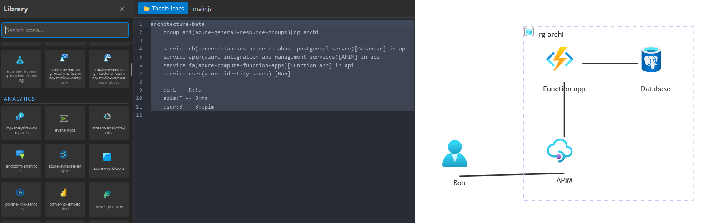

# Mermaid Architecture Diagram - Icon pack builder

Using icon folder from https://learn.microsoft.com/en-us/azure/architecture/icons/

To build the icon pack run `npm run buil-icons`

Run the editor with `npm run dev`

## Example 

```yaml
architecture-beta
    group api(azure-general-resource-groups)[rg archi]

    service db(azure:databases-azure-database-postgresql-server)[Database] in api
    service apim(azure-integration-api-management-services)[APIM] in api
    service fa(azure-compute-function-apps)[Function app] in api
    service user(azure-identity-users) [Bob]
    
    db:L -- R:fa
    apim:T -- B:fa
    user:B -- B:apim

```
